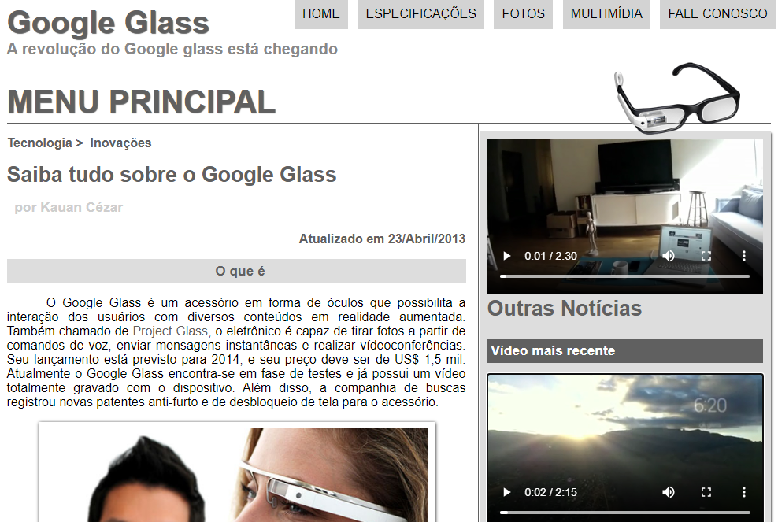
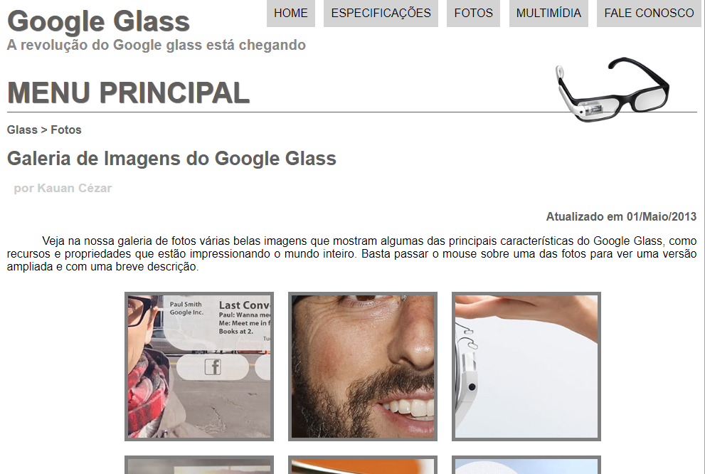
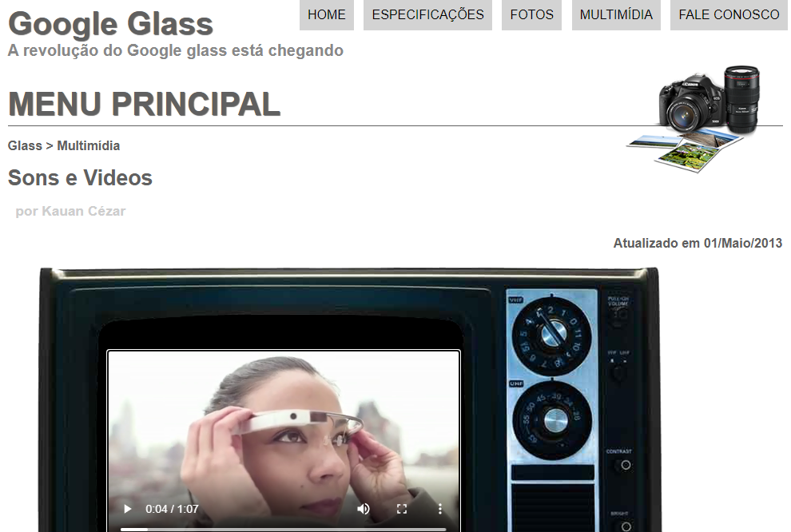
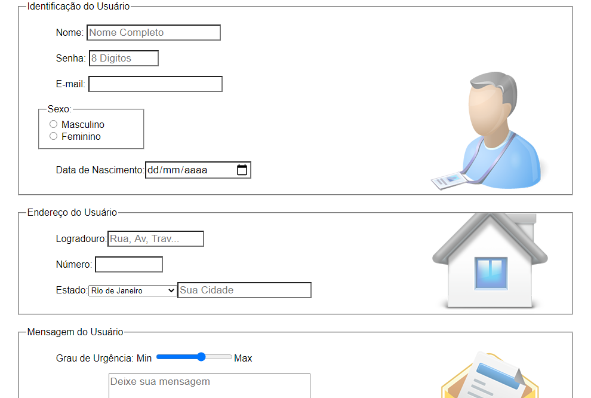

<h1 align="center">
## Google Glass 
</h1>

<p align="center">
    
    
    
    
</p>

## About
Eu criei este site durante uma aula online de HTML5

## Technologies

**- HTML5**
<br>
**- CSS3**
<br>
**- Javascript**
<br>

## Building

No installation or configuration is required to be able to use the papitos, just clone the project.

```bash
git clone https://github.com/hyankelwin/papitos-web.git  ** colocar sua url
```

Ready just run the file **index.html** enjoy the interface :)
